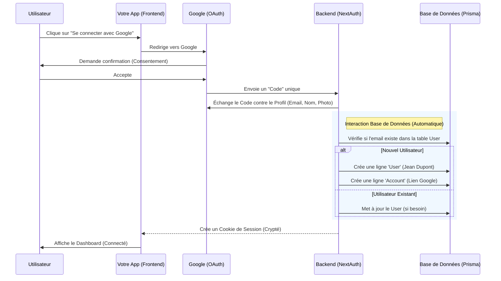

# Comprendre l'Authentification Google (NextAuth + Prisma)

Voici comment votre application gère la connexion, étape par étape.

## 🔄 Le Flux (Workflow)



## 💾 Côté Base de Données

Tout se passe grâce à **Prisma Adapter** que nous avons configuré. Il gère 3 tables principales (`prisma/schema.prisma`) :

### 1. `User` (L'Humain)
C'est votre utilisateur unique.
- **Rôle** : Stocke l'identité centrale.
- **Données** : `id`, `name`, `email`, `image`.
- **Lien** : C'est cet `id` (ex: `cm6...`) qui sera utilisé pour sauvegarder les CVs.

### 2. `Account` (La Méthode de Connexion)
C'est le lien technique avec Google.
- **Rôle** : Permet à un utilisateur d'avoir plusieurs méthodes de connexion (ex: Google + GitHub demain).
- **Données** : `provider: "google"`, `access_token`, `refresh_token`.
- **Lien** : Relié à la table `User`.

### 3. `Session` (La Connexion Active)
*Note: Comme nous utilisons la stratégie JWT pour être compatible "Edge", cette table est parfois moins utilisée, mais elle sert si on veut stocker les sessions en base.*

## 🛡️ Côté Code (Backend)

1.  **Le Gardien (`middleware.ts`)** :
    Avant même d'afficher une page, il décrypte le cookie de l'utilisateur.
    *   Cookie Valide ? -> `req.auth` est rempli -> On laisse passer.
    *   Pas de Cookie ? -> Redirection `/login`.

2.  **L'API (`route.ts`)** :
    Quand vous appelez `/api/cv`, le serveur fait :
    ```typescript
    const session = await auth(); // Vérifie le cookie
    // Récupère l'ID de l'utilisateur en base
    const userId = session.user.id; 
    // Cherche les CVs qui appartiennent à cet ID
    prisma.cv.findMany({ where: { userId } })
    ```

**Résumé** : Google prouve l'identité, NextAuth traduit ça en "Session", et Prisma sauvegarde le tout proprement dans votre base PostgreSQL.
